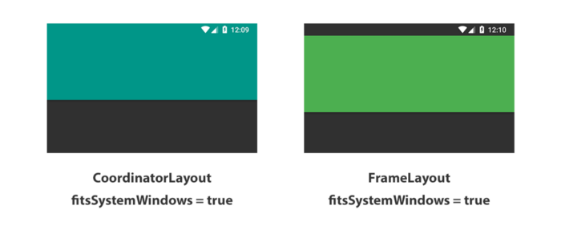

# Android_app

simple project 

<h3> Vector drawables overview </h3>

Android Studio can also convert SVG/PSD files to the vector drawable format<br>
The major advantage of using a vector drawable is image scalability. It can be scaled without loss of display quality, which means the same file is resized for different screen densities without loss of image quality. This results in smaller APK files and less developer maintenance


```diff
+  Right click on app folder-> New Vector Asset.
+  Select second option in radio button to create vector from local file as shown in below image.
```

for more doc see this <a href="https://developer.android.com/guide/topics/graphics/vector-drawable-resources" target="_blank">link</a> <br>
<br>
When people want to put some View under status bar they usually can find the answer like:


```diff
-  “Just add “fitsSystemWindows= true” and it should work fine. -No? 
-  Then change your root view to CoordinatorLayout and apply fitsSystemWindows = true”.
```

<br>
for more docs see this <a href="https://proandroiddev.com/draw-under-status-bar-like-a-pro-db38cfff2870" target="_blank">link1 </a>, <a href="https://medium.com/androiddevelopers/why-would-i-want-to-fitssystemwindows-4e26d9ce1eec" target="_blank">link2</a><br>

If I remove the tools:openDrawer="start", on the layout preview, the navigation drawer will be closed instead of open.<br>
I thought this was a replacement attribute, similar to android:text that can be replaced with tools:text to put some placeholder text in the layout preview.<br>
